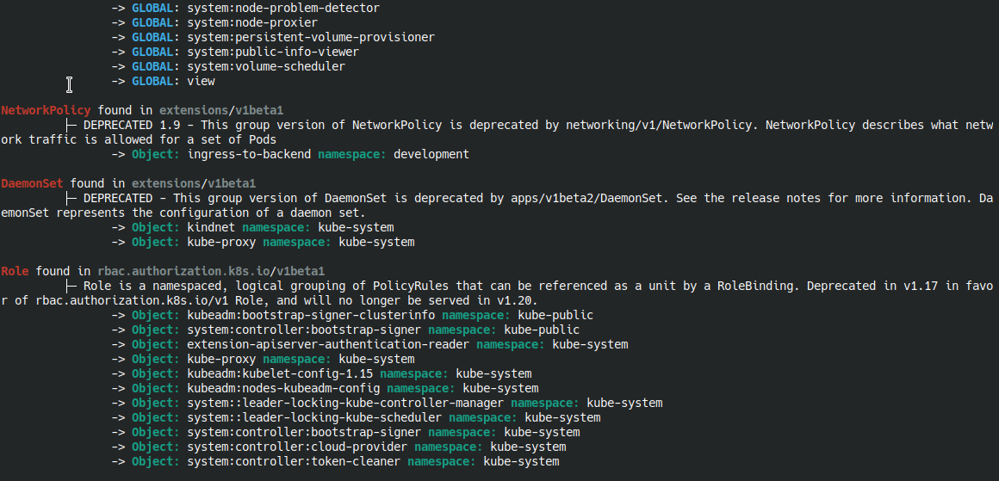

# KubePug - Pre UpGrade (Checker)
[](https://depshield.github.io)


This is a WIP. 


KubePug is intended to be a kubectl plugin, which:

* Downloads a swagger.json from a specific Kubernetes version
* Parses this Json finding deprecation notices
* Verifies the current kubernetes cluster checking wether exists objects in this deprecated API Versions, allowing the user to check before migrating
* Helps Katz to be a better developer (nooot!!)

## How to Use

Download the correct version from Releases page.

After that, the command can be used just as kubectl, but with the following flags:

```
$ kubepug --help
[...]
Flags:
      --cluster string       The name of the kubeconfig cluster to use
      --context string       The name of the kubeconfig context to use
      --description          Wether to show the description of the deprecated object. The description may contain the solution for the deprecation. Defaults to true (default true)
      --force-download       Wether to force the download of a new swagger.json file even if one exists. Defaults to false
  -h, --help                 help for kubectl
      --k8s-version string   Which kubernetes release version (https://github.com/kubernetes/kubernetes/releases) should be used to validate objects. Defaults to master (default "master")
      --kubeconfig string    Path to the kubeconfig file to use for CLI requests.
      --swagger-dir string   Where to keep swagger.json downloaded file. Defaults to current directory

$ kubepug --k8s-version=v1.17.0 # Will verify the current context against v1.17.0 swagger.json
[...]
ClusterRole found in rbac.authorization.k8s.io/v1beta1
         ├─ ClusterRole is a cluster level, logical grouping of PolicyRules that can be referenced as a unit by a RoleBinding or ClusterRoleBinding. Deprecated in v1.17 in favor of rbac.authorization.k8s.io/v1 ClusterRole, and will no longer be served in v1.20.
                -> GLOBAL: admin 
                -> GLOBAL: cluster-admin 
                -> GLOBAL: edit 

NetworkPolicy found in extensions/v1beta1
         ├─ DEPRECATED 1.9 - This group version of NetworkPolicy is deprecated by networking/v1/NetworkPolicy. NetworkPolicy describes what network traffic is allowed for a set of Pods
                -> Object: ingress-to-backend namespace: development

DaemonSet found in extensions/v1beta1
         ├─ DEPRECATED - This group version of DaemonSet is deprecated by apps/v1beta2/DaemonSet. See the release notes for more information. DaemonSet represents the configuration of a daemon set.
                -> Object: kindnet namespace: kube-system
                -> Object: kube-proxy namespace: kube-system

```

## Screenshot


## Todo
* Add Reverse / Stressful testing - kubepug checks deprecated APIs from swagger.json file to verify if there's some 'to be DEPRECATED' API. But when there's an already removed API it cannot find. So Reverse will walk through all the objects from the API Server (or at least those containing items) and check if that API still exists in future swagger.json. This might be API intensive!!
* Add some Unit Tests
* Turn this into a kubectl plugin :)


## References

As I've used this project to learn Go and also some Kubernetes [client-go](https://github.com/kubernetes/client-go/) some parts of this plugin are based in Caio Begotti's [Pod-Tree](https://github.com/caiobegotti/Pod-Dive), Ahmet Balkan [kubectl-tree](https://github.com/ahmetb/kubectl-tree) and Bitnami [Kubecfg](https://github.com/bitnami/kubecfg)

Logo based in <a href="https://br.freepik.com/fotos-vetores-gratis/mao">Mão vetor criado por freepik - br.freepik.com</a>

